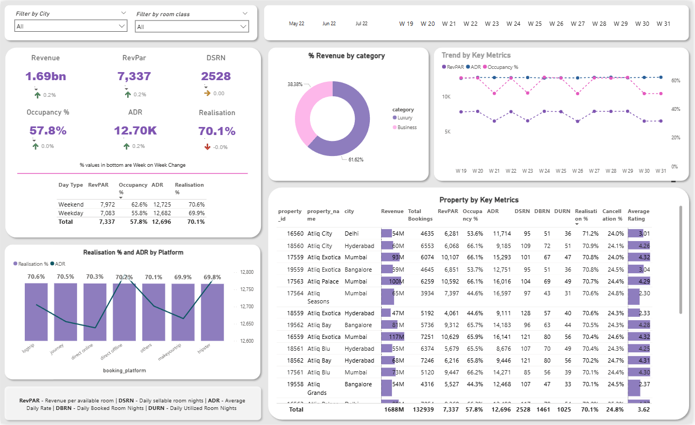

# 🏥 Healthcare_Analytics_Project

---

## 🌟 Project Goal

This project delivers a robust and interactive **Healthcare_Analytics_Project** built with **Microsoft Power BI**. The core objective is to transform complex, disparate hospital data into clear, actionable insights for administrative staff, clinical leaders, and executive management.

The dashboard aims to facilitate **data-driven decision-making** by providing a unified view of operational efficiency, patient quality metrics, and financial stability, ultimately driving continuous improvement in patient care and resource utilization.

---

## ✨ Key Dashboard Features & Insights

The visualizations are organized into three primary areas of focus:

### 1. Operational Efficiency & Capacity
| Metric | Purpose |
| :--- | :--- |
| **Average Length of Stay (LOS)** | Identifies bottlenecks in discharge processes and clinical pathways. |
| **Bed Occupancy Rate** | Tracks real-time utilization to optimize patient flow and resource allocation. |
| **ER Wait Time** | Measures the speed of service delivery in the emergency department, a critical patient satisfaction factor. |

### 2. Patient Quality & Safety
| Metric | Purpose |
| :--- | :--- |
| **30-Day Readmission Rate** | Key indicator of post-discharge care effectiveness and care coordination. |
| **Hospital-Acquired Infection (HAI) Rate** | Monitors patient safety protocols and infection control effectiveness. |
| **Patient Satisfaction Scores (HCAHPS)** | Visualizes survey results to measure the patient experience. |

### 3. Financial Health
| Metric | Purpose |
| :--- | :--- |
| **Revenue vs. Budget** | Tracks financial performance against annual targets. |
| **Cost Per Case/Service Line** | Provides detailed costing analysis to identify areas for cost reduction without compromising care quality. |

---

## 🛠️ Technical Stack

* **Platform:** **Microsoft Power BI Desktop** (`.pbix` file)
* **Data Modeling:** Relational model built using Power BI's capabilities.
* **Calculations:** Custom measures written in **Data Analysis Expressions (DAX)**.
* **Data Sources:** CSV and Excel files currently stored in the local `Data Folder`.

---

## 📁 Repository Structure

The project repository contains the following critical files and folders:

| File/Folder | Type | Description |
| :--- | :--- | :--- |
| `Healthcare_Analytics_Project.pbix` | Power BI File | The primary project file containing the data model, DAX, reports, and visualizations. **Requires Power BI Desktop to open.** |
| `Data Folder/` | Directory | Contains the raw data files (e.g., admissions, billing, staffing) used to populate the dashboard. |
| `dashboard_preview.png` | Image | A static preview image of the final dashboard layout for quick viewing. |
| `README.md` | Documentation | This document, providing an overview and instructions for the project. |

---

## 🚀 Getting Started

Follow these steps to view and interact with the dashboard on your local machine:

### Prerequisites

1.  Install **Microsoft Power BI Desktop**. It is available as a free download from the Microsoft website or the Windows Store.
2.  Have **Git** installed to clone the repository.

### Setup Instructions

1.  **Clone the Repository:**
    ```bash
    git clone [https://github.com/jasmin882005/Healthcare_Analytics_Project.git](https://github.com/jasmin882005/Healthcare_Analytics_Project.git)
    cd Healthcare_Analytics_Project
    ```

2.  **Open the Dashboard:**
    Double-click the `Healthcare_Analytics_Project.pbix` file. Power BI Desktop will launch and attempt to load the data.

3.  **Troubleshoot Data Source Paths (If Needed):**
    If the data connection breaks (because Power BI is looking for the data at the original file creator's path), you must redirect the source paths:
    * In Power BI Desktop, navigate to **Home** tab and click **Transform data**.
    * In the Power Query Editor, go to **Home** tab and click **Data source settings**.
    * Select the broken source, click **Change Source...**, and redirect the path to the `Data Folder` within your newly cloned local repository.
    * Click **Close & Apply** to refresh the data.

---

## 🖼️ Preview



---

## 🤝 Contributing

We welcome contributions to this project! If you have suggestions for new metrics, improved DAX calculations, or design enhancements, please feel free to submit a **Pull Request** or open an **Issue**.
